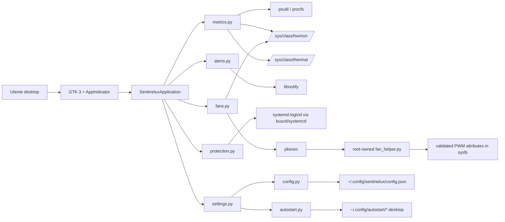

# Sentinelux — dossier pubblico e handoff per matt88.it

> **ARCHIVIO STORICO — NON usare questo documento come scheda tecnica della
> prima release.** Il dossier fotografa la fase pre-alpha del 22 luglio 2026
> e contiene riferimenti a sperimentazioni PWM successivamente escluse dal
> candidato `v0.1.0-alpha.1`. Per lo scope aggiornato consultare
> [Sentinelux alpha brief](sentinelux-alpha-brief.md), i
> [README](../../README.md) e le
> [note della prerelease](../releases/v0.1.0-alpha.1.md).


Data dell’analisi: **22 luglio 2026**

Perimetro delle fonti: repository pubblico `matteodurso88/sentinelux`, commit remoto `8b7eec4317128ea10b010b75f991ee100be33cfa`, working tree ricostruito con le funzioni `0.0.3`–`0.0.5`, test locali, screenshot condivisi nella conversazione e decisioni esplicite del progetto. Dove una verifica non è disponibile viene usata la dicitura `DA CONFERMARE`.

# 1. Scheda sintetica

| Campo | Valore |
|---|---|
| Nome prodotto | Sentinelux |
| Categoria | Monitor hardware e termico per desktop Linux |
| Tagline | Stato del sistema e temperature, direttamente nella tray. |
| Problema affrontato | Rendere immediatamente visibili carico, memoria e temperature, con alert e azioni preventive su computer Linux soggetti a surriscaldamento o con risorse limitate. |
| Utenti principali | Utenti desktop Linux, proprietari di computer datati, sviluppatori e tecnici che vogliono un controllo locale rapido. |
| Piattaforme confermate | Linux desktop della famiglia Debian; validazione locale su Xfce/X11. Distribuzione e versione esatte: `DA CONFERMARE`. |
| Stato attuale | Pre-alpha per uso personale; funzioni principali operative, distribuzione pubblica non ancora confezionata. |
| Disponibilità | Codice sorgente in repository GitHub pubblico; installazione tramite script utente. Nessuna release binaria confermata. |
| Modello di prezzo | Gratuito e open source; nessun piano commerciale documentato. |
| Licenza | GPL-3.0-or-later |
| Repository | `https://github.com/matteodurso88/sentinelux` |
| Versione corrente | `0.0.5` nel working tree da consolidare; non rilasciata |
| Data dell’ultima verifica | 2026-07-22 |

Fonti principali: `pyproject.toml`, `README.md`, `CHANGELOG.md`, `src/sentinelux/__init__.py`, metadati GitHub e conversazione di progetto.

# 2. Executive summary

## Descrizione pubblica breve

Sentinelux è un monitor open source per desktop Linux che rende visibili dalla tray carico CPU, pressione RAM, swap, temperature CPU e ventole quando disponibili. Offre soglie configurabili, notifiche termiche, avvio automatico e una protezione preventiva opzionale tramite ibernazione o sospensione. Il progetto è in fase pre-alpha e si installa attualmente dal codice sorgente su sistemi della famiglia Debian.

## Descrizione estesa

Sentinelux nasce per chi usa Linux su macchine che possono scaldarsi, rallentare o avere poca memoria disponibile e vuole capire rapidamente cosa sta succedendo senza tenere aperto un pannello complesso. La tray mostra CPU, RAM, swap, temperature package/core e, quando il kernel espone i dati, lo stato delle ventole. La percentuale RAM usa la memoria realmente disponibile secondo il modello Linux, evitando di presentare cache e buffer come consumo rigido.

L’utente può configurare soglie di attenzione e criticità, isteresi, promemoria e tipi di notifica. Una protezione preventiva, disattivata per impostazione predefinita, può richiedere ibernazione o sospensione dopo una temperatura elevata persistente, se `systemd-logind` autorizza l’azione. Sentinelux visualizza inoltre, senza modificarla, la soglia termica `critical` più bassa esposta dal kernel. Il controllo PWM delle ventole è disponibile solo su hardware che espone tachimetro, valore PWM e modalità di controllo; sugli altri computer la telemetria resta in sola lettura.

La versione corrente è una build pre-alpha installabile per singolo utente. Non sono ancora disponibili pacchetti `.deb`, repository APT, aggiornamenti automatici, dashboard storica o release pubblica stabile.

**Perché Sentinelux esiste:** per trasformare segnali tecnici dispersi nel sistema Linux in informazioni immediate e comprensibili, prima che un problema termico interrompa il lavoro.

**Beneficio principale:** l’utente vede a colpo d’occhio lo stato essenziale del computer e può configurare avvisi o azioni preventive coerenti con le capacità reali della macchina.

# 3. Problema e destinatari

## Scenario reale

Il prodotto nasce dall’uso di un computer Linux datato, soggetto a temperature elevate e all’intervento delle protezioni termiche. Strumenti come `top`, `sensors` e i file di `/sys` forniscono informazioni utili, ma richiedono terminale, interpretazione e consultazioni separate. L’esigenza è avere un indicatore sempre presente, leggibile e configurabile, senza eseguire l’intera applicazione con privilegi amministrativi.

Fonti: decisioni della conversazione; screenshot `Istantanea_2026-07-22_05-06-38.png`; moduli `metrics.py`, `app.py`, `protection.py`.

## Problemi risolti

- consultazione rapida di CPU, RAM e swap;
- lettura aggregata di temperature package e core;
- distinzione tra RAM non disponibile e memoria recuperabile;
- notifica delle transizioni termiche senza controllo manuale continuo;
- visualizzazione della soglia critica kernel quando esposta;
- gestione dell’avvio automatico;
- rilevamento dei limiti hardware senza presentare controlli non supportati;
- esportazione di uno snapshot JSON per verifiche tecniche.

## Categorie di utenti

- utenti Linux desktop che preferiscono un’interfaccia tray;
- persone che usano computer datati o con raffreddamento limitato;
- sviluppatori che eseguono carichi intensivi e vogliono un indicatore persistente;
- tecnici e manutentori che necessitano di una lettura locale veloce;
- utenti che non vogliono una piattaforma cloud o un agente di monitoraggio remoto.

## Contesti d’uso

- lavoro quotidiano su portatili e desktop Linux;
- compilazioni, browser pesanti, macchine virtuali e carichi CPU temporanei;
- verifica delle temperature dopo manutenzione o pulizia;
- controllo di RAM disponibile su sistemi con poca memoria;
- prevenzione di interruzioni termiche, quando ibernazione o sospensione sono supportate.

## Alternative attuali e limiti

- `top` e `htop`: ottimi per processi e memoria, ma non sono una presenza tray e non integrano la policy Sentinelux;
- `sensors`: mostra dati hardware in terminale, ma non offre l’esperienza unificata di tray, preferenze e notifiche;
- monitor di sistema del desktop: possono mostrare risorse generiche, ma supporto termico, trip point kernel e gestione ventole variano;
- `fancontrol`: è più adatto a curve PWM persistenti, ma richiede calibrazione e configurazione amministrativa; Sentinelux usa solo preset di sessione e controlli conservativi.

## Quando Sentinelux non è adatto

- monitoraggio di server remoti o flotte;
- raccolta storica e osservabilità centralizzata;
- diagnosi hardware professionale o test di stabilità;
- gestione avanzata di processi;
- sistemi senza tray AppIndicator;
- computer su cui temperature e ventole non sono esposte dal kernel;
- protezione termica garantita: Sentinelux non sostituisce BIOS, firmware, kernel o hardware;
- utenti che richiedono oggi un pacchetto firmato, aggiornamenti automatici o supporto commerciale.

# 4. Funzionalità

## Implementate

| Funzione | Descrizione orientata all’utente | Stato | Piattaforme | Fonte di verifica |
|---|---|---|---|---|
| Tray icon | Mantiene Sentinelux visibile nella tray e mostra temperatura massima o carico CPU. | Implementata | Linux desktop con AppIndicator | `src/sentinelux/app.py`; screenshot tray |
| Menu rapido | Menu piatto con valori immediatamente visibili e senza sottomenu sensori. | Implementata | Linux desktop | `app.py`; `presentation.py` |
| CPU | Mostra utilizzo CPU totale percentuale. | Implementata | Linux con `psutil` | `metrics.py`; `app.py`; `tests/test_metrics.py` |
| Temperature CPU | Mostra package e core del gruppo sensori selezionato, quando esposti. | Implementata | Linux con sensori supportati | `metrics.py`; `app.py`; test metriche |
| RAM | Mostra percentuale coerente, memoria non disponibile sul totale e memoria disponibile. | Implementata | Linux con `psutil` | `metrics.py`; `presentation.py`; test |
| Swap | Mostra percentuale e quantità usata sul totale. | Implementata | Linux con `psutil` | `metrics.py`; `app.py` |
| Sensori CPU | Esclude candidati plausibilmente non CPU e usa il sensore più caldo per la policy. | Implementata | Linux; copertura hardware variabile | `metrics.py`; test selezione sensori |
| Notifiche | Alert di attenzione, criticità, promemoria e recupero tramite libnotify. | Implementata | Desktop con servizio notifiche | `alerts.py`; `app.py` |
| Soglie | Soglie warning/critical, isteresi e promemoria modificabili. | Implementata | Tutte le piattaforme supportate | `config.py`; `settings.py` |
| Configurazione | Finestra GTK con schede Monitoraggio, Alert, Protezione, Ventole e Avvio. | Implementata | GTK 3 | `settings.py`; screenshot protezione |
| Persistenza preferenze | Salvataggio atomico JSON in percorso XDG. | Implementata | Linux utente | `config.py`; test configurazione |
| Avvio automatico | Crea o rimuove una desktop entry XDG per la sessione utente. | Implementata | Desktop XDG compatibile | `autostart.py`; `settings.py`; test |
| Trip point kernel | Mostra la soglia `critical` più bassa esposta dal thermal framework, senza modificarla. | Implementata in sola lettura | Linux con thermal zones | `protection.py`; test; screenshot |
| Snapshot dati | `--once` stampa un singolo snapshot JSON senza GUI. | Implementata | Linux CLI | `__main__.py`; `metrics.py` |
| Log runtime | Log su console con livello debug opzionale. | Implementata, essenziale | Tutte le piattaforme supportate | `__main__.py`; `app.py` |
| Installazione utente | Copia launcher, sorgenti e desktop entry in percorsi XDG utente. | Implementata | Linux desktop | `scripts/install-user.sh` |
| Disinstallazione utente | Rimuove applicazione e autostart, conservando la configurazione. | Implementata | Linux desktop | `scripts/uninstall-user.sh` |

## Parzialmente implementate

| Funzione | Descrizione orientata all’utente | Stato | Piattaforme | Fonte di verifica |
|---|---|---|---|---|
| Protezione termica preventiva | Può richiedere ibernazione o sospensione dopo una temperatura persistente. | Parziale: dipende da logind, swap, policy e autorizzazioni; disattivata di default | Linux con systemd-logind | `protection.py`; `settings.py`; screenshot con azione non autorizzata |
| Ventole | Mostra RPM/PWM/modalità; i preset sono abilitati solo se il canale è verificabile. | Parziale: sul computer testato nessun canale è esposto; supporto dipendente dall’hardware | Linux hwmon | `fans.py`; `fan_helper.py`; test; decisione chat |
| Controllo PWM | Preset temporanei con helper root-owned e `pkexec`. | Parziale e opzionale; non validato su hardware reale nel progetto | Linux hwmon compatibile | `fans.py`; `fan_helper.py`; script helper |
| Interfaccia completa | Esiste una finestra di preferenze articolata. | Parziale: manca una dashboard completa con dettagli e grafici | GTK 3 | `settings.py`; roadmap |
| Carico di sistema | È visibile l’utilizzo CPU totale. | Parziale: non sono mostrati load average e breakdown per core di utilizzo | Linux | `metrics.py`; `app.py` |
| Sensori generici | Sono letti sensori CPU e fan hwmon. | Parziale: non esiste un catalogo completo di sensori hardware | Linux | `metrics.py`; `fans.py` |
| Localizzazione | Documentazione principale disponibile in IT/EN. | Parziale: interfaccia runtime italiana, nessun sistema i18n | Tutti | stringhe sorgente; README IT/EN |
| Accessibilità | Usa widget GTK standard e testi visibili. | `DA CONFERMARE`: nessun audit, navigazione tastiera o lettore schermo documentato | GTK 3 | `settings.py`; assenza test dedicati |
| Aggiornamento | È possibile reinstallare dal nuovo sorgente. | Parziale: nessun updater o migrazione release automatica | Linux | `install-user.sh`; documentazione |
| Gestione errori | Errori di salvataggio e preset mostrati in dialogo; errori runtime loggati. | Parziale: nessun crash reporter o recupero globale | Linux desktop | `settings.py`; `app.py` |
| Esportazione dati | Snapshot JSON singolo. | Parziale: nessuna serie storica o file periodico | CLI | `__main__.py` |

## Pianificate

| Funzione | Descrizione orientata all’utente | Stato | Piattaforme | Fonte di verifica |
|---|---|---|---|---|
| Batteria | Stato, capacità e salute batteria. | Pianificata | Portatili Linux | `README.md`; `docs/PERSONAL_BUILD.md` |
| Alimentazione | Informazioni su rete elettrica e profilo energetico. | Pianificata | Linux | conversazione iniziale; roadmap |
| Storage | Capacità, utilizzo e indicatori storage. | Pianificata | Linux | README/roadmap |
| SMART | Informazioni diagnostiche disco quando disponibili. | Pianificata | Linux con strumenti/permessi dedicati | `docs/PERSONAL_BUILD.md` |
| Rete | Monitoraggio base della rete. | Pianificata | Linux | README/roadmap |
| Processi | Elenco e analisi dei processi. | Pianificata | Linux | dossier richiesto; non presente nel codice |
| Grafici e storico | Andamento di temperature e risorse nel tempo. | Pianificata | Linux desktop | README/roadmap |
| Dashboard completa | Finestra principale con dettagli oltre alle preferenze. | Pianificata | GTK/Linux | obiettivo iniziale; stato attuale |
| Curve ventole avanzate | Curve termiche persistenti e calibrazione. | Pianificata, non progettata in dettaglio | Hardware compatibile | `CHANGELOG.md`; README |
| Pacchetto `.deb` | Installazione nativa Debian. | Pianificata | Debian-family | decisione progetto; roadmap |
| Repository APT | Aggiornamenti tramite dominio matt88.it. | Pianificata, architettura `DA CONFERMARE` | Debian-family | conversazione progetto |
| Aggiornamenti automatici | Notifica o applicazione nuove versioni. | Pianificata | Linux | assenza attuale; roadmap |
| Integrazione matt88.it | Scheda software bilingue e collegamento release. | Pianificata; dossier pronto | Web matt88.it | `docs/DEFERRED_MATT88_INTEGRATION.md`; questo dossier |
| Asset brand | Logo, icona dedicata e screenshot pubblici. | Pianificati | GitHub e sito | inventario media |

## Escluse o non previste

| Funzione | Descrizione orientata all’utente | Stato | Piattaforme | Fonte di verifica |
|---|---|---|---|---|
| Modifica trip point kernel/BIOS | Sentinelux non consente di cambiare soglie critiche di kernel, BIOS, firmware o hardware. | Esclusa | Tutte | `protection.py`; README |
| Sostituzione delle protezioni hardware | L’app agisce eventualmente prima della soglia, ma non disattiva le protezioni native. | Esclusa | Tutte | decisione chat; documentazione |
| Preset ventola a zero | Non viene offerta una modalità che arresti volontariamente la ventola. | Esclusa | Hardware PWM | `fans.py`; test |
| Preset ventole automatici all’accesso | I preset PWM non sono persistiti né applicati al login. | Esclusa nella build attuale | Hardware PWM | `fans.py`; CHANGELOG |
| Telemetria remota | Nessuna raccolta o invio di metriche è implementato. | Non prevista nella build attuale | Runtime | analisi codice |
| Esecuzione completa come root | L’applicazione resta utente; solo un helper ristretto può essere privilegiato. | Esclusa | Linux | `fan_helper.py`; script installazione |

# 5. Esperienza utente

1. **Installazione.** L’utente clona o scarica i sorgenti, installa le dipendenze con `scripts/install-deps-debian.sh` e può eseguire `scripts/install-user.sh`. Non esistono ancora `.deb`, wizard o store.
2. **Primo avvio.** `scripts/run-dev.sh` o `~/.local/bin/sentinelux` carica la configurazione; se manca, crea `~/.config/sentinelux/config.json`.
3. **Presenza nella tray.** AppIndicator crea l’icona e un’etichetta con temperatura o CPU. È richiesta una tray compatibile.
4. **Consultazione rapida.** Il menu mostra CPU, RAM, swap, sensori CPU e ventole. Valori non esposti vengono indicati come non disponibili.
5. **Apertura della finestra completa.** Il comando **Preferenze…** apre una finestra a schede. Una vera dashboard di monitoraggio completa non è ancora implementata.
6. **Configurazione delle soglie.** L’utente modifica warning, critical, isteresi, intervallo e tipi di alert. La protezione preventiva richiede una soglia inferiore al trip point kernel quando questo è noto.
7. **Ricezione e chiusura notifiche.** Le notifiche sono inviate al servizio desktop tramite libnotify. La chiusura segue il comportamento del desktop; non sono presenti pulsanti d’azione personalizzati.
8. **Errori e sensori mancanti.** La tray segnala metriche non disponibili; le pagine Protezione e Ventole spiegano capacità e limiti. Errori di salvataggio o preset producono un dialogo. Gli errori di lettura vengono registrati su console.
9. **Aggiornamento software.** Non implementato come funzione. Occorre aggiornare i sorgenti e rieseguire `scripts/install-user.sh`.
10. **Disinstallazione.** `scripts/uninstall-user.sh` rimuove launcher, applicazione e autostart ma conserva la configurazione. L’helper ventole richiede `scripts/uninstall-fan-helper.sh`.

# 6. Architettura tecnica

## Componenti verificati

- **Linguaggio:** Python 3, requisito `>=3.10`.
- **Build metadata:** setuptools tramite `pyproject.toml`.
- **Toolkit grafico:** GTK 3 con PyGObject.
- **Tray:** Ayatana AppIndicator 3, con fallback AppIndicator 3 legacy.
- **Notifiche:** libnotify tramite GI.
- **Metriche:** `psutil` più fallback diretti a sysfs per temperature.
- **Persistenza:** JSON atomico sotto XDG config.
- **Autostart:** desktop entry XDG.
- **Protezione termica:** lettura thermal zones, interrogazione `systemd-logind` con `busctl`, richiesta azione con `systemctl`.
- **Ventole:** lettura hwmon; scrittura PWM tramite helper Python root-owned invocato da `pkexec`.
- **Logging:** modulo standard `logging`, output console.
- **Test:** `unittest`, 42 test superati nella verifica 2026-07-22.
- **CI/CD:** nessun workflow presente.

## Struttura moduli

| Modulo | Responsabilità |
|---|---|
| `src/sentinelux/__main__.py` | CLI, configurazione, snapshot JSON e avvio GUI |
| `app.py` | ciclo GTK, tray, refresh, notifiche e coordinamento |
| `metrics.py` | CPU, RAM, swap e temperature |
| `alerts.py` | macchina a stati warning/critical/recovery |
| `protection.py` | persistenza termica, trip point e sleep action |
| `fans.py` | discovery hwmon, preset e ripristino di sessione |
| `fan_helper.py` | validazione e scrittura privilegiata PWM |
| `config.py` | modello e persistenza JSON |
| `autostart.py` | gestione desktop entry XDG |
| `settings.py` | finestra preferenze |
| `presentation.py` | formattazione valori e nomi sensori |

## Diagramma Mermaid



## Packaging e aggiornamenti

`pyproject.toml` definisce un progetto Python installabile, ma il percorso realmente documentato e testato è lo script per utente. Non sono presenti pipeline di build, pacchetti Debian, firma o canale di aggiornamento. L’aggiornamento consiste nella nuova copia dei sorgenti tramite `install-user.sh`.

## Privilegi

- monitoraggio e preferenze: utente normale;
- installazione dipendenze: `sudo apt`;
- installazione helper ventole: `sudo install`;
- preset PWM: autorizzazione `pkexec`;
- sospensione/ibernazione: policy di `systemd-logind`;
- nessuna esecuzione completa dell’app come root.

# 7. Compatibilità e requisiti

| Area | Stato verificato |
|---|---|
| Distribuzioni | Famiglia Debian come target. Distribuzione/versione testata: `DA CONFERMARE`. |
| Python | 3.10, 3.11 e 3.12 dichiarati nei classifier; requisito minimo 3.10. |
| Desktop environment | Xfce osservato nello screenshot e nei processi della sessione locale. Altri desktop: `DA CONFERMARE`. |
| X11 | Validazione locale osservata con Xorg/Xfce. |
| Wayland | `DA CONFERMARE`. |
| Architetture CPU | `DA CONFERMARE`; nessuna matrice di test presente. |
| Toolkit | GTK 3, PyGObject, AppIndicator compatibile. |
| Dipendenze native | `python3`, `python3-gi`, `python3-psutil`, `gir1.2-gtk-3.0`, `gir1.2-ayatanaappindicator3-0.1`, `gir1.2-notify-0.7`, `libnotify-bin`, `pkexec`, `xdg-utils`. |
| systemd | Richiesto solo per protezione preventiva; monitoraggio base può avviarsi senza usare l’azione. |
| Sensori temperature | Opzionali; i valori possono mancare o essere soltanto package-level. |
| Ventole | Opzionali; molti portatili tengono controllo e telemetria nel BIOS/EC. |
| Trip point kernel | Opzionale; può non essere esposto. |
| Ibernazione | Dipende da kernel, swap, logind e policy. |
| Tray | Necessaria implementazione AppIndicator/Ayatana compatibile. |

Non è corretto estendere il supporto a tutte le distribuzioni Debian, a Wayland o a ogni architettura senza ulteriori prove.

# 8. Sicurezza e privacy

## Dati letti

- utilizzo CPU, memoria virtuale e swap tramite `psutil`;
- temperature da psutil e `/sys/class/hwmon` o `/sys/class/thermal`;
- trip point termici `critical`;
- RPM, PWM e modalità ventole;
- stato di autorizzazione logind per ibernazione/sospensione;
- presenza dell’autostart e percorsi XDG.

## Dati salvati

- configurazione JSON locale;
- desktop entry dell’installazione e dell’autostart;
- copia locale dei sorgenti installati;
- nessuna cronologia delle metriche;
- nessun database.

## Dati trasmessi

Il runtime analizzato non contiene client HTTP, telemetria o sincronizzazione. L’installazione delle dipendenze usa naturalmente i repository APT configurati dal sistema. Le azioni `systemctl`, `busctl` e `pkexec` sono comunicazioni locali con servizi di sistema.

## Privilegi e misure

- l’app principale non richiede root;
- l’helper ventole deve essere di proprietà root e non scrivibile da gruppo/altri;
- l’helper accetta soltanto percorsi con forma `/sys/class/hwmon/hwmonN/pwmN[_enable]`;
- i symlink devono risolversi sotto `/sys/devices`;
- valori e modalità vengono limitati a interi in intervalli definiti;
- nessun preset zero viene offerto;
- il feedback RPM viene verificato dopo un preset manuale;
- il controllo iniziale viene ripristinato alla chiusura normale;
- la protezione termica è disattivata di default e validata rispetto al trip point kernel quando disponibile.

## Rischi e verifiche aperte

- il ripristino PWM non è garantito in caso di kill, crash, power loss o sessione terminata brutalmente;
- nessuna prova PWM reale è stata eseguita sull’hardware del progetto;
- la richiesta `systemctl hibernate/suspend` può fallire dopo l’armamento;
- nessun audit di sicurezza indipendente;
- nessun crash reporting o log rotation;
- le notifiche possono mostrare dati termici sulla schermata del desktop;
- la configurazione non è cifrata, ma contiene solo preferenze;
- comportamento con più utenti e sessioni concorrenti: `DA CONFERMARE`;
- policy Polkit dedicata: non presente;
- threat model formale: non presente.

# 9. Distribuzione open source

| Elemento | Stato |
|---|---|
| Licenza | GPL-3.0-or-later, file `LICENSE` presente |
| Repository | Pubblico: `matteodurso88/sentinelux` |
| Branch strategy | Default `main`; nessuna strategia formale documentata |
| Contribuzione | Nessun `CONTRIBUTING.md`; tracker dichiarato nel manifest |
| Issue tracker | URL presente in `pyproject.toml`; nessuna issue aperta trovata il 2026-07-22 |
| Changelog | Presente, versioni `0.0.1`–`0.0.5` marcate Unreleased |
| Release/tag | Nessuna release referenziata nel materiale analizzato; stato GitHub Releases: `DA CONFERMARE` |
| Pacchetto `.deb` | Non presente |
| Repository APT | Non presente |
| Firma pacchetti | Non presente |
| Checksum release | Non presente |
| Aggiornamento | Manuale tramite aggiornamento sorgenti e reinstallazione utente |
| Installazione da sorgente | Implementata tramite script Debian e installer per utente |
| Wheel/PyPI | Metadata setuptools presente; pubblicazione e procedura: `DA CONFERMARE` |
| Pull request | Nessuna PR rilevata al 2026-07-22 |

La pubblicazione iniziale sul sito dovrebbe usare il repository come destinazione primaria e indicare chiaramente che non esiste ancora una release installabile.

# 10. Stato del prodotto

Le percentuali non vengono riportate perché non esiste una misura di avanzamento documentata.

| Area | Stato | Percentuale | Blocchi aperti | Criterio di completamento | Fonte |
|---|---|---:|---|---|---|
| Core monitoring | Operativo | — | Matrice hardware limitata | Test su più CPU e distribuzioni | `metrics.py`, test |
| Tray | Operativa | — | Compatibilità desktop da estendere | Verifica su GNOME/KDE/Xfce e Wayland | `app.py`, screenshot |
| Interfaccia completa | Parziale | — | Manca dashboard dettagli | Finestra dati completa e navigabile | `settings.py`, roadmap |
| Notifiche | Operative | — | Variabilità desktop | Test su più notification daemon | `app.py`, `alerts.py` |
| Configurazione | Operativa | — | Migrazioni future | Schema/versioning configurazione | `config.py`, test |
| Protezione termica | Parziale | — | Autorizzazione logind e test reali | Test controllati su suspend/hibernate | `protection.py`, screenshot |
| Ventole | Parziale | — | Hardware test non espone canali | Validazione su hardware PWM compatibile | `fans.py`, chat |
| Packaging | Iniziale | — | Nessun `.deb` | Pacchetto riproducibile e firmabile | script, roadmap |
| Installazione | Operativa per utente | — | Solo Debian-family e sorgente | Installer documentato su sistemi target | `install-user.sh` |
| Aggiornamenti | Non implementati | — | Nessun canale release | Meccanismo definito e testato | roadmap |
| Documentazione | Buona base bilingue | — | Mancano guida contribuzione e support matrix | README, guide e policy complete | README IT/EN, dossier |
| Test | 42 unit test locali | — | Nessuna CI e test GUI/hardware | CI più smoke test desktop | directory `tests` |
| Accessibilità | `DA CONFERMARE` | — | Nessun audit | Test tastiera, contrasto e screen reader | assenza evidenze |
| Localizzazione | Parziale | — | UI italiana hard-coded | gettext o sistema equivalente IT/EN | sorgenti UI |
| Release pubblica | Non disponibile | — | Packaging, asset, support matrix | Tag, changelog chiuso, artefatti e note | changelog/repo |

# 11. Media e asset

| Asset | Disponibilità | Sanitizzazione | Percorso/file | Alt IT | Alt EN | Autorizzazione pubblicazione |
|---|---|---|---|---|---|---|
| Logo | Non disponibile | N/A | Nessun file repository | Logo Sentinelux | Sentinelux logo | `DA CONFERMARE` |
| Icona dedicata | Non disponibile; usa icone di sistema | N/A | `utilities-system-monitor`, `dialog-warning`, `dialog-error` | Icona di monitoraggio sistema | System monitoring icon | Non applicabile come asset proprietario |
| Favicon | Non disponibile | N/A | Nessun file | Favicon Sentinelux | Sentinelux favicon | `DA CONFERMARE` |
| Screenshot tray | Disponibile in chat | Non sanitizzato: desktop, browser, utente e sessione visibili | `Istantanea_2026-07-22_05-06-38.png` | Menu tray di Sentinelux con CPU, RAM, swap e temperature | Sentinelux tray menu showing CPU, RAM, swap and temperatures | Non autorizzato finché non sanitizzato e approvato |
| Screenshot impostazioni protezione | Disponibile in chat | Non sanitizzato; include errore autorizzazione e desktop personale | `Istantanea_2026-07-22_05-39-10.png` | Preferenze di protezione termica con soglia kernel | Thermal protection preferences with kernel threshold | Non autorizzato finché non sanitizzato e approvato |
| Screenshot tray precedente | Disponibile in chat | Non idoneo: rappresenta una build intermedia difettosa | `Istantanea_2026-07-22_04-39-09.png` | Build intermedia del menu tray | Intermediate tray-menu build | `NON PUBBLICABILE` |
| Altri screenshot | Presenti ma non classificati | `DA CONFERMARE` | `Istantanea_2026-07-21_19-17-53.png`, `Istantanea_2026-07-21_19-19-49.png` | Schermata di sviluppo Sentinelux | Sentinelux development screenshot | `DA CONFERMARE` |
| Screenshot notifiche | Non disponibile come asset dedicato | N/A | Nessun file verificato | Notifica termica Sentinelux | Sentinelux thermal notification | `DA CONFERMARE` |
| Screenshot configurazione completo | Non disponibile in forma sanitizzata | N/A | Nessun file repository | Preferenze Sentinelux | Sentinelux preferences | `DA CONFERMARE` |
| Diagramma architettura | Disponibile nel dossier come Mermaid | Testuale, senza dati personali | `docs/public/sentinelux-matt88-dossier.md` | Diagramma dei componenti Sentinelux | Sentinelux component diagram | Pubblicabile con il dossier |
| Video/GIF | Non disponibile | N/A | Nessun file | Dimostrazione Sentinelux | Sentinelux demonstration | `DA CONFERMARE` |

Prima della pubblicazione servono catture nuove, ritagliate sull’applicazione, con hostname, nome utente, applicazioni, file e notifiche personali non visibili.

# 12. Copy italiano per matt88.it

## Eyebrow

Software open source per Linux

## Titolo hero

Tieni sotto controllo il tuo PC Linux

## Accento del titolo

direttamente dalla tray

## Descrizione hero

Sentinelux mostra CPU, memoria, swap e temperature in un menu rapido, con soglie e notifiche configurabili. È pensato per desktop Linux della famiglia Debian e si trova attualmente in fase pre-alpha, disponibile dal repository sorgente.

## CTA primaria

Esplora il repository

## CTA secondaria

Consulta lo stato del progetto

## Tre benefici

### Informazioni immediate

Apri la tray e consulta carico CPU, pressione RAM, swap e temperature senza passare tra più strumenti.

### Alert configurabili

Definisci soglie, isteresi e tipi di notifica in base al comportamento reale del tuo computer.

### Protezione consapevole dell’hardware

Visualizza i limiti esposti dal kernel e abilita azioni preventive soltanto quando il sistema le supporta.

## Descrizione funzionalità

Sentinelux raccoglie metriche locali e le presenta in un menu compatto. Le temperature package e core vengono raggruppate automaticamente e il sensore più caldo guida gli alert. La memoria è mostrata usando la disponibilità stimata da Linux, così cache e buffer non vengono confusi con memoria definitivamente occupata. Le ventole restano in sola lettura sui computer che non espongono controlli PWM verificabili.

## Come funziona

1. Installa le dipendenze e avvia Sentinelux dal repository.
2. Consulta le metriche dalla tray.
3. Apri le preferenze per impostare soglie e notifiche.
4. Abilita l’avvio automatico, se necessario.
5. Valuta la protezione preventiva solo dopo aver verificato il supporto di ibernazione o sospensione.

## Stato del prodotto

Sentinelux è una build pre-alpha per uso personale e sperimentazione. Le funzioni principali di tray, metriche, alert e configurazione sono operative; packaging, aggiornamenti automatici e dashboard completa sono ancora in sviluppo.

## Nota di disponibilità

Il codice sorgente è pubblico. Non sono ancora disponibili una release stabile, un pacchetto `.deb` o un repository APT.

## CTA finale

Segui lo sviluppo di Sentinelux su GitHub

## FAQ

### Sentinelux è già pronto per l’uso quotidiano?

È una build pre-alpha. Può essere usata per test personali, ma non è ancora distribuita come release stabile.

### Quali distribuzioni supporta?

Il target attuale è la famiglia Debian. La matrice completa di distribuzioni e versioni è ancora da verificare.

### Funziona su Wayland?

`DA CONFERMARE`. La validazione locale disponibile riguarda Xfce/X11.

### Invia dati su Internet?

Il runtime analizzato non implementa telemetria o chiamate di rete. L’installazione delle dipendenze usa i normali repository del sistema.

### Può controllare le ventole?

Solo quando il kernel espone RPM, PWM e modalità di controllo per lo stesso canale. Su molti portatili la pagina resta correttamente in sola lettura.

### Può impedire lo spegnimento termico?

No. Sentinelux non modifica o disabilita le protezioni di kernel, BIOS, firmware o hardware. Può tentare prima un’azione preventiva configurata.

### Perché l’ibernazione può risultare non autorizzata?

La disponibilità dipende da swap, kernel, `systemd-logind` e policy dell’utente. Sentinelux impedisce di salvare una protezione che il sistema dichiara non disponibile.

### Come si aggiorna?

Per ora occorre aggiornare i sorgenti e rieseguire lo script di installazione utente.

### Cosa succede alla configurazione durante la disinstallazione?

Lo script rimuove l’applicazione e conserva il file di configurazione, così può essere riutilizzato dopo una reinstallazione.

### Sono disponibili pacchetti `.deb`?

Non ancora. Packaging Debian e repository APT sono pianificati.

## Meta title

Sentinelux | Monitor termico Linux open source

## Meta description

Monitora CPU, RAM, swap e temperature dalla tray Linux con alert configurabili. Sentinelux è open source e disponibile in fase pre-alpha.

## Testo Open Graph

Sentinelux porta metriche e protezione termica nella tray Linux: CPU, memoria, temperature e alert configurabili in un progetto open source.

## Slug consigliato

`/it/software/sentinelux/`

# 13. English copy for matt88.it

## Eyebrow

Open-source software for Linux

## Hero title

Keep an eye on your Linux PC

## Highlighted title accent

right from the system tray

## Hero description

Sentinelux shows CPU, memory, swap and temperatures in a compact tray menu with configurable thresholds and notifications. It currently targets Debian-family Linux desktops and is available as a pre-alpha source build.

## Primary CTA

Explore the repository

## Secondary CTA

View project status

## Three benefits

### Immediate visibility

Open the tray to check CPU load, RAM pressure, swap and temperatures without switching between multiple tools.

### Configurable alerts

Set thresholds, recovery hysteresis and notification types around the actual behaviour of your computer.

### Hardware-aware protection

See the limits exported by the kernel and enable preventive actions only when the system reports them as supported.

## Feature description

Sentinelux collects local metrics and presents them in a compact menu. Package and core temperatures are grouped automatically, and the hottest sensor drives alerts. Memory uses Linux availability accounting so cache and buffers are not treated as permanently consumed RAM. Fan controls remain read-only when the computer does not expose a verifiable PWM channel.

## How it works

1. Install the dependencies and start Sentinelux from the repository.
2. Read the current metrics from the tray.
3. Open Preferences to configure thresholds and notifications.
4. Enable per-user autostart when needed.
5. Consider preventive protection only after checking hibernation or suspension support.

## Product status

Sentinelux is a pre-alpha build for personal use and experimentation. Tray monitoring, metrics, alerts and configuration are operational; packaging, automatic updates and a full dashboard are still in development.

## Availability note

The source code is public. A stable release, `.deb` package and APT repository are not available yet.

## Final CTA

Follow Sentinelux development on GitHub

## FAQ

### Is Sentinelux ready for daily use?

It is a pre-alpha build. It can be tested for personal use, but it is not distributed as a stable release yet.

### Which distributions are supported?

The current target is the Debian family. A complete distribution and version matrix has not been verified.

### Does it work on Wayland?

`DA CONFERMARE`. The available local validation was performed on Xfce/X11.

### Does it send data over the Internet?

The analysed runtime does not implement telemetry or network calls. Installing dependencies uses the system’s configured package repositories.

### Can it control fans?

Only when the kernel exposes RPM, PWM and a readable control mode for the same channel. Many laptops correctly remain read-only.

### Can it replace the computer’s thermal shutdown?

No. Sentinelux does not change or disable kernel, BIOS, firmware or hardware protections. It can only request a configured preventive action beforehand.

### Why can hibernation be reported as unauthorized?

Support depends on swap, the kernel, `systemd-logind` and user policy. Sentinelux refuses to save a protection action that the system reports as unavailable.

### How is Sentinelux updated?

For now, update the source tree and rerun the per-user installation script.

### What happens to the configuration on uninstall?

The uninstall script removes the application while keeping the configuration file for a future reinstall.

### Are `.deb` packages available?

Not yet. Debian packaging and an APT repository are planned.

## Meta title

Sentinelux | Open-source Linux thermal monitor

## Meta description

Monitor CPU, RAM, swap and temperatures from the Linux tray with configurable alerts. Sentinelux is open source and currently pre-alpha.

## Open Graph text

Sentinelux brings system metrics and thermal awareness to the Linux tray: CPU, memory, temperatures and configurable alerts in an open-source project.

## Recommended slug

`/en/software/sentinelux/`

# 14. Dati strutturati per l’integrazione

```yaml
product:
  id: sentinelux
  name: Sentinelux
  category: linux-system-monitor
  status: pre-alpha
  availability: source-only
  pricing:
    model: free
  source:
    model: open-source
    license: GPL-3.0-or-later
    repository: https://github.com/matteodurso88/sentinelux
  platforms:
    - linux
    - debian-family
  technologies:
    - Python
    - GTK 3
    - PyGObject
    - psutil
    - Ayatana AppIndicator
    - libnotify
    - systemd-logind
  features:
    - tray-monitoring
    - cpu-usage
    - coherent-memory-availability
    - swap-usage
    - cpu-temperature-sensors
    - thermal-alerts
    - configurable-thresholds
    - preventive-hibernation-or-suspension
    - read-only-kernel-critical-trip-point
    - optional-hwmon-fan-telemetry
    - xdg-autostart
    - json-snapshot
  routes:
    it: /it/software/sentinelux/
    en: /en/software/sentinelux/
  seo:
    it:
      title: Sentinelux | Monitor termico Linux open source
      description: Monitora CPU, RAM, swap e temperature dalla tray Linux con alert configurabili. Sentinelux è open source e disponibile in fase pre-alpha.
    en:
      title: Sentinelux | Open-source Linux thermal monitor
      description: Monitor CPU, RAM, swap and temperatures from the Linux tray with configurable alerts. Sentinelux is open source and currently pre-alpha.
  version:
    current: 0.0.5
    released: false
  distribution:
    deb_package: false
    apt_repository: false
    automatic_updates: false
  localization:
    documentation:
      - it
      - en
    runtime:
      - it
```

# 15. Elementi mancanti prima della pubblicazione

## Blocker

| Azione | Responsabile | Evidenza richiesta | Impatto | Dipendenze |
|---|---|---|---|---|
| Consolidare e pubblicare il commit `0.0.5` | Matteo D’Urso | Commit remoto con codice, README bilingue e dossier | Il sito non deve descrivere codice non presente su GitHub | Test e revisione finale |
| Decidere se la pagina presenta una pre-alpha senza download | Matteo D’Urso / matt88.it | Decisione editoriale e CTA approvata | Evita una CTA “Scarica” senza artefatto | Stato repository |
| Produrre almeno uno screenshot sanitizzato | Matteo D’Urso | Immagine senza dati personali, coerente con `0.0.5` | Necessario per una pagina prodotto credibile | Build installata |
| Verificare denominazione legale/autore pubblico | Matteo D’Urso | Nome/copyright da mostrare | Necessario per footer, licenza e crediti | Informazioni legali matt88.it |
| Confermare distro e versione testate | Matteo D’Urso | Output sistema o nota verificata | Evita claim di compatibilità generici | Macchina di test |

## Necessari

| Azione | Responsabile | Evidenza richiesta | Impatto | Dipendenze |
|---|---|---|---|---|
| Creare una release o dichiarare esplicitamente “pre-alpha disponibile solo come sorgente” | Matteo D’Urso | Tag/release oppure copy approvato | Chiarisce disponibilità | Commit consolidato |
| Aggiungere support matrix minima | Progetto Sentinelux | Test su distro/desktop/sessione | Migliora affidabilità del copy | Ambienti di test |
| Definire canale issue e contributi | Progetto Sentinelux | `CONTRIBUTING.md` e template essenziale | Rende il repository accogliente | Workflow GitHub |
| Verificare la pagina su X11 e Wayland | Progetto Sentinelux | Report riproducibile | Riduce ambiguità compatibilità | Macchine/VM |
| Chiudere changelog `Unreleased` per una versione pubblica | Progetto Sentinelux | Data release e note | Coerenza GitHub/sito | Decisione release |
| Confermare che il dominio/route matt88.it esista | Team matt88.it | Route implementata | Necessario per pubblicazione | Repository matt88.it |

## Consigliati

| Azione | Responsabile | Evidenza richiesta | Impatto | Dipendenze |
|---|---|---|---|---|
| Creare logo e icona dedicata | Design/matt88.it | SVG/PNG e licenza asset | Riconoscibilità | Identità visiva |
| Aggiungere screenshot tray, alert e preferenze | Matteo D’Urso | Asset sanitizzati IT/EN | Migliora comprensione | Build stabile |
| Aggiungere CI per 42 test | Progetto Sentinelux | Workflow verde su `main` | Aumenta fiducia | GitHub Actions |
| Testare installazione pulita | Progetto Sentinelux | VM Debian-family | Riduce problemi onboarding | Script dipendenze |
| Aggiungere guida troubleshooting | Progetto Sentinelux | Casi sensori mancanti, logind e tray | Riduce richieste supporto | Test utenti |
| Audit accessibilità GTK | Progetto/matt88.it | Checklist tastiera e screen reader | Migliora inclusività | UI stabile |

## Post-lancio

| Azione | Responsabile | Evidenza richiesta | Impatto | Dipendenze |
|---|---|---|---|---|
| Pacchetto `.deb` e firma | Progetto Sentinelux | Build riproducibile, firma, checksum | Installazione semplice | Packaging |
| Repository APT | matt88.it / infrastruttura | Hosting, metadata firmati | Aggiornamenti nativi | Pacchetto `.deb` |
| Dashboard storica | Progetto Sentinelux | Specifica UX e storage locale | Valore avanzato | Architettura dati |
| Batteria, storage, rete e processi | Progetto Sentinelux | Moduli e test | Amplia copertura | Roadmap |
| Localizzazione runtime EN | Progetto Sentinelux | Cataloghi gettext e test | Coerenza sito/app | Refactoring stringhe |
| Aggiornamenti integrati | Progetto Sentinelux | Policy e canale release | Manutenzione utenti | Release firmate |

# 16. Registro delle affermazioni

| Affermazione pubblicabile | Stato | Fonte | Confidenza | Note |
|---|---|---|---|---|
| Sentinelux è open source con licenza GPL-3.0-or-later. | CONFERMATA | `LICENSE`, `pyproject.toml` | Alta | Repository pubblico |
| Il progetto è sviluppato da matt88.it. | PARZIALE | contesto progetto e homepage manifest | Media | Formula legale/brand da approvare |
| Mostra CPU, RAM, swap e temperature nella tray. | CONFERMATA | `app.py`, `metrics.py`, screenshot | Alta | Sensori dipendono dall’hardware |
| Mostra package e core quando disponibili. | CONFERMATA | `metrics.py`, test | Alta | Non garantiti su ogni CPU |
| La RAM usa la memoria disponibile Linux. | CONFERMATA | `metrics.py`, `presentation.py`, test | Alta | Pattern `0.0.5` |
| Invia telemetria o metriche a server remoti. | NON PUBBLICABILE | nessuna implementazione | Alta | L’affermazione positiva sarebbe falsa |
| Non implementa telemetria runtime. | CONFERMATA | analisi codice | Alta | Evitare claim assoluti futuri |
| Le preferenze sono salvate localmente in JSON. | CONFERMATA | `config.py` | Alta | Percorso XDG |
| L’avvio automatico è gestibile dalla GUI. | CONFERMATA | `settings.py`, `autostart.py` | Alta | Desktop XDG |
| Può ibernare o sospendere in caso di temperatura persistente. | PARZIALE | `protection.py`, `app.py` | Alta | Solo se autorizzato/supportato |
| Sostituisce lo spegnimento termico del kernel. | NON PUBBLICABILE | design esplicito contrario | Alta | Non deve essere affermato |
| Mostra la soglia critica kernel in sola lettura. | CONFERMATA | `protection.py`, screenshot | Alta | Solo se esposta |
| Controlla le ventole su ogni computer. | NON PUBBLICABILE | hardware test non espone canali | Alta | Supporto condizionale |
| Può mostrare ventole e usare preset su hwmon compatibile. | PARZIALE | `fans.py`, `fan_helper.py`, test | Media-alta | Nessun test hardware reale |
| Non offre preset ventola a zero. | CONFERMATA | `fans.py`, test | Alta | Minimo 55% |
| È compatibile con tutte le distribuzioni Debian. | DA CONFERMARE | target generale, test limitato | Bassa | Non pubblicare come claim |
| È stato testato su Xfce/X11. | CONFERMATA | screenshot e sessione locale | Media-alta | Distro/versione non registrate |
| È compatibile con Wayland. | DA CONFERMARE | nessun test | Bassa | |
| Richiede Python 3.10 o superiore. | CONFERMATA | `pyproject.toml` | Alta | |
| Dispone di 42 test unitari superati. | CONFERMATA | esecuzione locale 2026-07-22 | Alta | Nessuna CI |
| È disponibile come `.deb`. | NON PUBBLICABILE | nessun pacchetto | Alta | Pianificato |
| È disponibile tramite repository APT. | NON PUBBLICABILE | nessun repository | Alta | Pianificato |
| È disponibile come sorgente pubblico su GitHub. | CONFERMATA | metadati repository | Alta | |
| La versione corrente è `0.0.5`. | CONFERMATA | working tree, `pyproject.toml`, `__init__.py` | Alta | Da consolidare e pubblicare |
| Esiste una release stabile. | NON PUBBLICABILE | changelog Unreleased | Alta | |
| L’interfaccia runtime è bilingue. | NON PUBBLICABILE | stringhe italiane | Alta | Solo documentazione bilingue |
| La documentazione principale è disponibile in italiano e inglese. | CONFERMATA | `README.it.md`, `README.en.md` | Alta | Dopo commit consolidato |
| Gli screenshot attuali sono pronti per il sito. | NON PUBBLICABILE | asset con dati desktop personali | Alta | Servono nuove catture |
| Il monitoraggio base non richiede root. | CONFERMATA | architettura e script | Alta | Funzioni privilegiate separate |
| Il controllo PWM usa un helper ristretto e root-owned. | CONFERMATA | `fan_helper.py`, `fans.py` | Alta | Installazione opzionale |
| Il progetto è pronto per una release pubblica generale. | DA CONFERMARE | pre-alpha e blocker aperti | Bassa | Non usare come claim |
